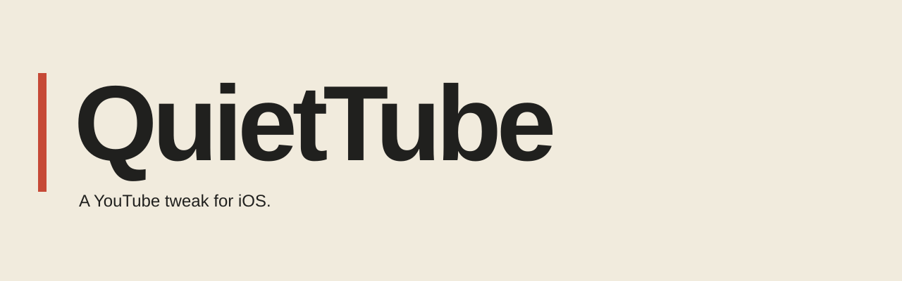
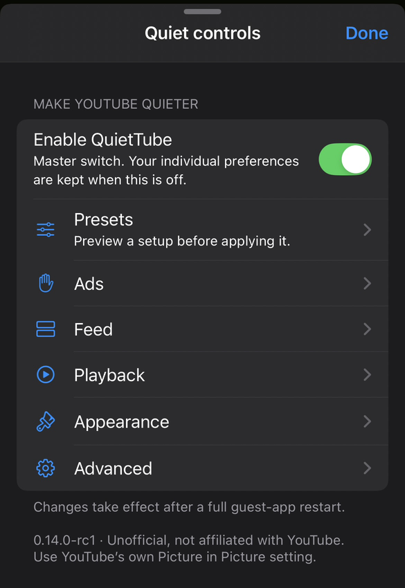
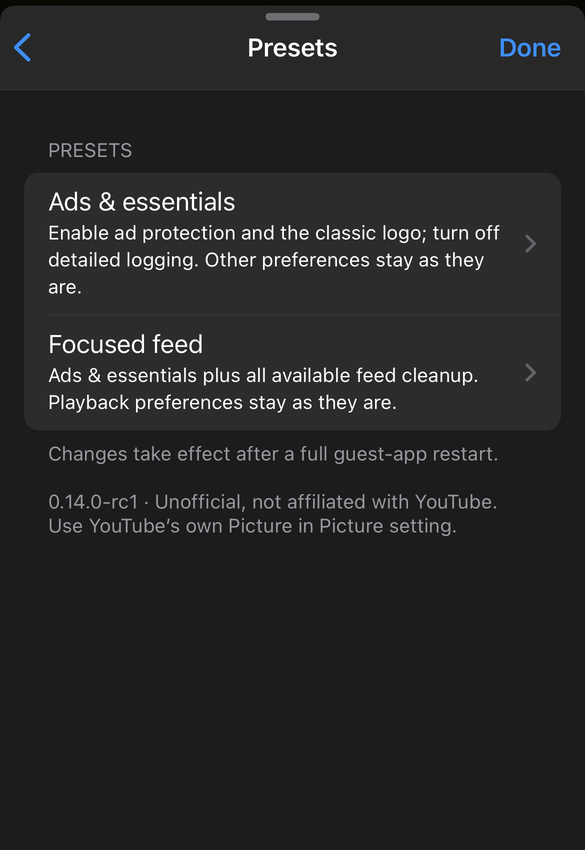

  

  <strong>An annoyance-free idea. A quieter way to watch.</strong> 
  Native YouTube customization for iOS, built around the video—not everything surrounding it.

  <a href="https://github.com/KalvinWasUnoticed/QuietTube/fork"><strong>Fork & build ↗</strong></a>
  &nbsp; · &nbsp; <a href="docs/INSTALL.md">Installation guide</a>
  &nbsp; · &nbsp; <a href="https://github.com/KalvinWasUnoticed/QuietTube/issues">Get help</a>

> **Bring your own compatible base.** Fork the repository, run Actions with a direct HTTPS URL to your authorized decrypted YouTube **21.38.2** IPA, and download the built IPA from **your fork’s Releases**. The exact inspected SHA256 is required—not every repackaged 21.38.2 file will work. Public forks publish publicly accessible assets. [Requirements and rights acknowledgement →](docs/INSTALL.md#before-you-start)

## Why QuietTube?

QuietTube started with a simple frustration: opening YouTube to watch a video, then dealing with ads, promotional shelves and recommendations you never asked for.

The goal isn't to add another screen full of features. It's to make watching feel simple again: fewer interruptions, a calmer feed and controls that stay out of the way. The familiar native player stays. You choose what disappears.

## Keep the video. Lose the clutter.

| A little less… | A little more… |
| :--- | :--- |
| **Ad interruption** | Video-ad protection and filtering for recognized feed ads, including the tested post-minimize insertion path. |
| **Feed noise** | Optional hiding of Shorts shelves, Mixes, Watch it again, topic suggestions, Playables, promotional shelves and large portrait cards. |
| **Unwanted next videos** | A switch to stop supported automatic next-video actions. |
| **Settings friction** | Two preview-before-Apply presets, automatic prerequisite handling and restart notices without confirmation dialogs. |
| **Unnecessary reinvention** | Background audio, YouTube's native PiP setting and the classic header logo. |

These are scoped rules, not a promise to remove every ad or every matching surface. Shorts-tab removal, downloads and SponsorBlock are **not** included. [Coverage & limitations →](docs/SETTINGS.md)

## Your settings, not another dashboard

  
  &nbsp;&nbsp;
  

Real screenshots supplied from the tested RC1 settings build. Cropped/resized only; the layout is retained in 1.0.0. Right: preset chooser, not the Apply preview.

**Ads & essentials** enables ad protection and the classic logo, with detailed logging off. **Focused feed** adds the available feed-cleanup options. Both show what will change before you apply them and leave background-audio/next-video preferences alone.

Find everything at **You → Settings → General → Quiet controls**. Existing preferences are kept on upgrade. Fresh installs opt in. Changes apply after fully stopping and reopening the LiveContainer guest.

## Build it on your fork

1. **Fork** this repository into your GitHub account.
2. In **your fork**, open **Actions** and enable workflows if prompted.
3. Select **Build QuietTube IPA → Run workflow**.
4. Supply a **direct HTTPS download link** to your authorized decrypted YouTube 21.38.2 IPA and acknowledge the rights/publication notice.
5. After success, use **Summary → DOWNLOAD IPA** or your fork's **Releases**. Import the `.ipa` into LiveContainer and fully restart the guest.

No base-app URL is bundled in this repository. The workflow downloads your supplied input, verifies its exact hash, compiles QuietTube, packages the app and publishes the IPA plus source/hash metadata to the invoking fork. It does not publish to the original repository. It runs only manually, in a fork, with acknowledgement enabled.

[Full tutorial: SideStore → LiveContainer → fork → build → import →](docs/INSTALL.md)

**Publication matters:** a user-supplied URL and a fork are not legal clearance or a DMCA guarantee. You must have the rights to obtain, modify and publish the app. Workflow inputs are not secret storage; do not provide credentials or sensitive long-lived URLs.

## Tested, with boundaries

| Component | Reported test environment |
| :--- | :--- |
| Device | **iPhone 14** |
| iOS | **26.5** |
| LiveContainer | **3.8.0**, installed through SideStore |
| YouTube base | **21.38.2**, exact SHA256 checked during download and packaging |
| Confirmed by the maintainer | Ad blocking, Google sign-in, native PiP, background audio and the redesigned settings |

That evidence comes from the working 0.13.5 runtime and RC1 settings build retained for 1.0.0. It is not a broad compatibility matrix or a fresh test of every 1.0.0 artifact. The library targets iOS 17+ / arm64; other devices, app binaries and future server changes are not validated. [Validation & development →](CONTRIBUTING.md)

## Small by design

No automatic QuietTube diagnostic upload, activation service or added analytics endpoint. Optional local support reports are available under **Advanced → Troubleshooting**. Review them before sharing. YouTube and LiveContainer have their own data practices. [Privacy →](docs/PRIVACY.md)

For problems, [open an issue](https://github.com/KalvinWasUnoticed/QuietTube/issues/new/choose) with your version, device and steps to reproduce—never credentials or app binaries. Keep your known-working local build for rollback.

---

Made by **[KalvinWasUnoticed](https://github.com/KalvinWasUnoticed)** · [MIT source license](LICENSE) · [Credits & third-party notices](Notices/REFERENCES.md) · [Changelog](CHANGELOG.md)

QuietTube is unofficial and is not affiliated with or endorsed by YouTube or Google. YouTube and Google are their owners' trademarks. The source license does not license their app, services or branding. A user-provided base and publication in a fork do not guarantee immunity from legal claims or takedowns.
